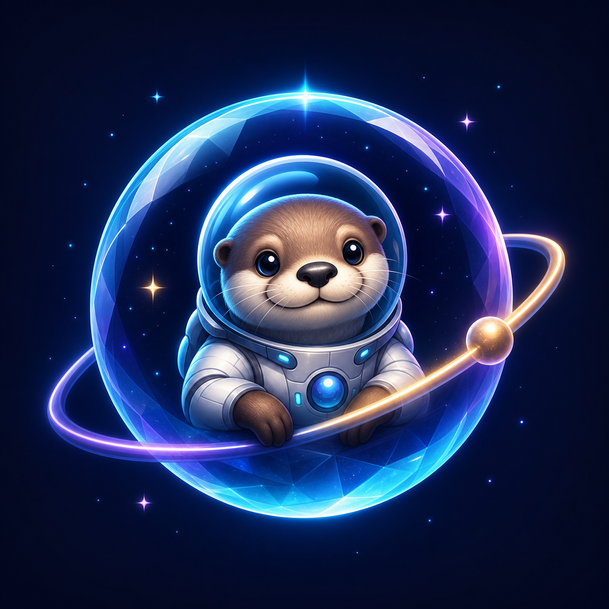

# NASA CHONG FLOTA



## Solo llámame nutria

La Nutria Astronauta nació como una imagen generada para representar el tono de la NASA de Chong: curiosidad, humor y aventura dentro de una burbuja cristalina. Esa imagen se convirtió en el emblema común de toda la flota. El azul medianoche aporta profundidad espacial; el cian comunica tecnología y claridad; el violeta añade el carácter interestelar; y el pequeño acento dorado representa la chispa juguetona de la misión.

El mismo máster alimenta favicon, PWA, perfil social, instaladores Electron y recursos Capacitor, evitando identidades diferentes entre plataformas.

Código compartido para web/PWA, Windows, macOS, Android e iOS.

## Arquitectura

- `apps/web`: interfaz compartida, PWA y modo offline.
- `apps/desktop`: contenedor Electron endurecido (`contextIsolation`, sandbox y sin Node en la página).
- `apps/mobile`: configuración Capacitor para Android/iOS.
- `backend`: Netlify Functions y SQL existentes. Los secretos viven únicamente en el hosting.

## Preparación

Requiere Node 20+ y acceso a npm:

```powershell
npm install
npm test
```

Antes de compilar, cambia `apps/web/config.js` para apuntar al Deploy Preview o a producción. El valor debe ser una URL pública; jamás agregues claves secretas.

## Windows

```powershell
npm run build:win
```

Genera el instalador en `release/`. La firma Authenticode requiere un certificado del propietario.

## macOS

Ejecutar en una Mac con Xcode:

```bash
npm install
npm run build:mac
```

Para distribución pública se necesitan Apple Developer ID, firma y notarización. Un `.dmg` confiable no puede producirse correctamente desde Windows sin esas credenciales.

## Android

```powershell
cd apps/mobile
npx cap add android
npm run sync
npm run android
```

Compila/firma el AAB desde Android Studio. Las notificaciones push reales requieren Firebase; el scaffold incluye la base para notificaciones locales.

## iOS

En macOS:

```bash
cd apps/mobile
npx cap add ios
npm run sync
npm run ios
```

Requiere Xcode y una cuenta Apple Developer. Cámara y micrófono deben solicitar permisos con descripciones claras antes de publicación.

## Pagos y secretos

Stripe Checkout y PayPal se abren fuera de la WebView. `SUPABASE_SERVICE_ROLE_KEY`, `STRIPE_SECRET_KEY`, `PAYPAL_CLIENT_SECRET` y `TELEGRAM_BOT_TOKEN` nunca se empaquetan en las apps. Las Netlify Functions conservan esas credenciales y verifican webhooks.

## Límites actuales

- Hay UI y persistencia local de misiones; sincronización de usuario requiere definir autenticación en Supabase.
- El reconocimiento de voz usa la API disponible del sistema/navegador.
- Push remoto requiere configurar APNs y Firebase.
- Se incluye un icono maestro, PNG de 16 a 1024 px, `.ico`, `.icns`, perfil social y splash. Capacitor puede derivar los catálogos nativos desde `apps/mobile/resources/` mediante `npx @capacitor/assets generate`.

## Estructura final

```text
NASA_CHONG_FLOTA/
  apps/
    web/
      assets/icon/       # Máster, PNG, ICO, ICNS y perfil social
    desktop/              # Electron para Windows/macOS
    mobile/resources/     # Fuentes para @capacitor/assets
  backend/                # Netlify Functions y SQL de Supabase
  tests/                  # Validaciones locales
  tools/build-icons.ps1   # Generador reproducible de recursos
```
